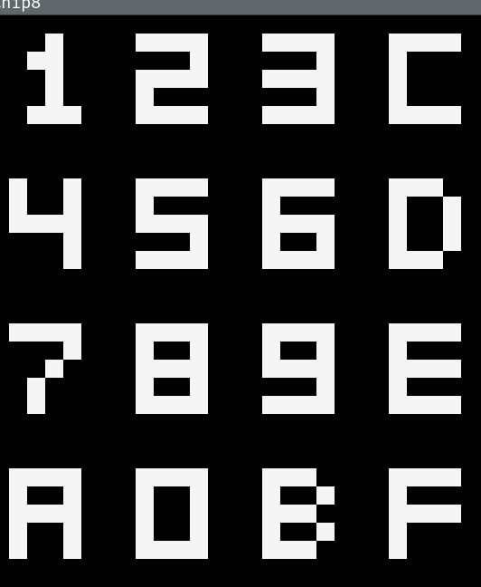
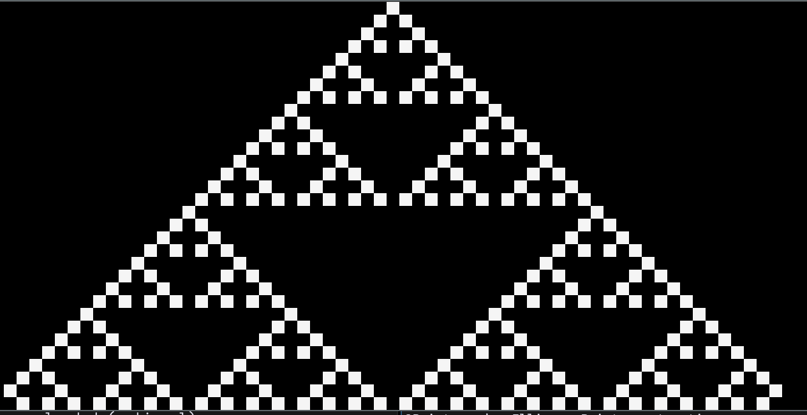
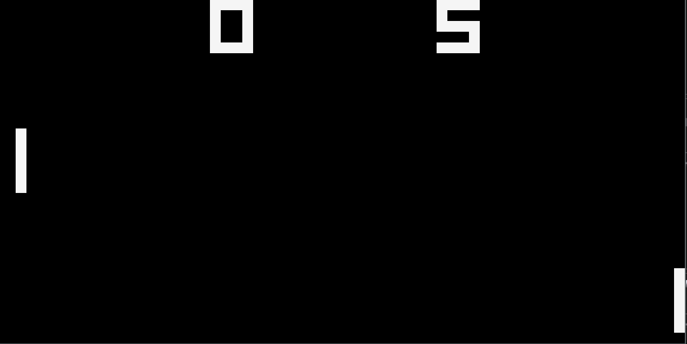

# Ch8
Building a Chip-8 Emulator from scratch.(currently using raylib library for window creation and Drawing).
The goal of this project is to document and share what i have learn't while building this emulator
All the Resources are described in chip-8.txt file.

# Test Examples.
### Chip8 Logo

### Keypad Test

### Sierpinski

### Single Player Pong

